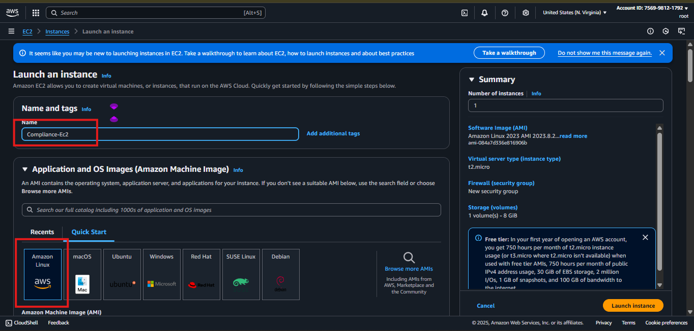

# PROJECT 4

---

# AWS Config Compliance Enforcement

**Project:** AWS Config Managed Rules  Practical Validation

**Department: DevOPs**

**Team:** Cloud Infrastructure Engineering

**Team Leader: Chinazor Nwode**

**Co-Leader:** Ifunanya Benedicta

---

## 

As part of our **continuous compliance validation program**, we, the cloud security engineering team, conducted a **controlled misconfiguration test** in our AWS development environment.

Our objective was to:

1. **Deliberately introduce** specific misconfigurations into various AWS resources.
2. **Observe AWS Config’s detection** of these misconfigurations in real time.
3. **Remediate** each issue and confirm compliance was restored.

We executed each scenario using the **STAR method** so that the process is clear, reproducible, and aligned with our organizational compliance playbooks.

---

## 1. EC2 Launch Template Policy – IMDSv2 Enforcement

**Rule:** `ec2-launch-template-imdsv2-check`

EC2 recommends using metadata version 2 you explicitly requires metadat version 1”

 We identified that enforcing IMDSv2 is critical to prevent metadata service exploitation. IMDSv1 leaves us open to SSRF-style credential theft.

Launch an EC2 instance using a launch template that does not enforce IMDSv2.

- We launched an EC2 instance from a template with IMDSv1 enabled.



- Click “Advanced Details”


- AWS Tried to warn us `EC2 recommends using metadata version 2, unless we explicitly wants the version 1`


- AWS Config flagged the instance as `COMPLIANT`. Which means this rule has an issue. so we created  Custom Lambda rule for it using Python code.

> Please Refer to PART 4 and get how this was achieved
> 

Lambda Function Python Code

### Click to view python code

```python
import json
import boto3
import os
import datetime

# Initialize the AWS Config client
CONFIG_CLIENT = boto3.client('config')

def lambda_handler(event, context):
    """
    The main handler for the AWS Lambda function.
    It receives an event from AWS Config and evaluates the compliance of an
    EC2 Launch Template by checking if it requires IMDSv2.

    Args:
        event (dict): The event object from AWS Config.
        context (object): The context object for the Lambda function.
    """
    print("Received event: " + json.dumps(event, indent=2))

    # Initializing variables to ensure they exist for the final evaluation
    resource_type = 'Unknown'
    resource_id = 'Unknown'
    ordering_timestamp = str(datetime.datetime.now())
    result_token = ''

    compliance_type = 'NOT_APPLICABLE'
    annotation = 'This resource type is not applicable for this rule.'

    try:
        invoking_event = json.loads(event['invokingEvent'])
        configuration_item = invoking_event['configurationItem']
        result_token = event['resultToken']
        
        resource_type = configuration_item.get('resourceType')
        resource_id = configuration_item.get('resourceId')
        ordering_timestamp = configuration_item.get('configurationItemCaptureTime')

        # Check if the resource is an EC2 Launch Template.
        if resource_type != 'AWS::EC2::LaunchTemplate':
            print(f"Skipping evaluation for non-EC2 Launch Template resource type: {resource_type}")
            compliance_type = 'NOT_APPLICABLE'
            annotation = 'This rule only applies to EC2 Launch Templates.'
            
        else:
            # --- Evaluate the Launch Template for IMDSv2 requirement ---
            # The launch template data is stored in the 'configuration' key.
            config_data = configuration_item.get('configuration', {})
            
            # We need to navigate through the LaunchTemplateData structure.
            launch_template_data = config_data.get('LaunchTemplateData', {})
            metadata_options = launch_template_data.get('MetadataOptions', {})
            
            # Check if ImdsSupport is set to 'required'.
            imds_support = metadata_options.get('ImdsSupport')
            
            if imds_support == 'required':
                compliance_type = 'COMPLIANT'
                annotation = "Launch template is compliant: IMDSv2 is required."
            else:
                compliance_type = 'NON_COMPLIANT'
                annotation = "Launch template is non-compliant: IMDSv2 is not required."
    
    except KeyError as e:
        # Gracefully handle cases where a key is missing from the event.
        print(f"KeyError: Missing key {e} in event. Skipping evaluation for this malformed event.")
        return {
            'statusCode': 200,
            'body': json.dumps(f"Missing key: {e}")
        }
    except Exception as e:
        # Catch any other unexpected errors and set the compliance status to NON_COMPLIANT
        # This will provide visibility into the error in your AWS Config dashboard.
        print(f"Error evaluating resource {resource_id}: {e}")
        compliance_type = 'NON_COMPLIANT'
        annotation = f"Failed to evaluate Launch Template: {e}"

    # Submit the evaluation results to AWS Config
    evaluations = [{
        'ComplianceResourceType': resource_type,
        'ComplianceResourceId': resource_id,
        'ComplianceType': compliance_type,
        'Annotation': annotation,
        'OrderingTimestamp': ordering_timestamp
    }]

    try:
        CONFIG_CLIENT.put_evaluations(
            Evaluations=evaluations,
            ResultToken=result_token
        )
        print(f"Submitted evaluation for {resource_id} with compliance status: {compliance_type}")
    except Exception as e:
        print(f"Error submitting evaluation to AWS Config: {e}")
        # Re-raise the exception to signal an unrecoverable failure
        raise e
    
    return {
        'statusCode': 200,
        'body': json.dumps('Evaluation submitted successfully')
    }

```

Inline Policy for Permission Role Json Code

### Click to view JSON code

```json
{
    "Version": "2012-10-17",
    "Statement": [
        {
            "Effect": "Allow",
            "Action": [
                "logs:CreateLogGroup",
                "logs:CreateLogStream",
                "logs:PutLogEvents"
            ],
            "Resource": "arn:aws:logs:*:*:*"
        },
        {
            "Effect": "Allow",
            "Action": "config:PutEvaluations",
            "Resource": "*"
        }
    ]
}
```

- So after creating the Lambda Function and applying it to Custom Lambda Rule in AWS Config, It immediatly flagged the instance as `NON-COMPLIANT`.


- We updated the launch template to require IMDSv2, then relaunched the instance using the updated template.
    
    The instance was marked `COMPLIANT`. This ensures that all new instances follow secure metadata access practices.
    
    
    

---

## 2. EBS Volume Encryption Enforcement

**Rule:** `encrypted-volumes`

Unencrypted EBS volumes violate our encryption-at-rest policy and introduce compliance risks under standards like HIPAA and PCI-DSS.

We Launched an EC2 instance with an unencrypted root EBS volume.

- We created an EC2 instance with an unencrypted volume.


- AWS Config immediately flagged it as `NON_COMPLIANT`.


- So We created an EC2 instance with an unencrypted volume.
- AWS Config immediately flagged it

AWS Config updated the resource to `COMPLIANT`. We confirmed our ability to enforce encrption on all persistent storage.


---

## 3. S3 Bucket Public Access Control

**Rule:** `s3-bucket-public-read-prohibited`

Public S3 buckets risk accidental or malicious exposure of sensitive data.

- We created a new S3 bucket and granted public read permissions.


- Created Policy for our S3 using policy generator


```json
{
    "Version": "2012-10-17",
    "Statement": [
        {
            "Sid": "Statement1",
            "Effect": "Allow",
            "Principal": "*",
            "Action": [
                "s3:DeleteObject",
                "s3:GetObject",
                "s3:PutObject",
                "s3:ReplicateObject",
                "s3:RestoreObject"
            ],
            "Resource": "arn:aws:s3:::my-buckect-ty/*"
        }
    ]
}
```

So we got issue here because of trying to add the S3 buckect as the direct resource, 


> S3 Buckect itself can’t be assesed as a rosource but what inside
> 

> So we added “/*”  at the end of the ARN of the S3 bucket and the error was raised off
> 

- AWS Config detected and marked it as `NON-OMPLIANT`.


- We blocked public access using the S3 **Block Public Access** feature and removed all public ACLs.

AWS Config marked the bucket as `COMPLIANT`. This reinforced our access control posture for object storage.


---

## 4. EC2 Without Key Pair

**Rule:** `ec2-no-amazon-key-pair`

Launching Instances without key pairs prevent secure SSH access and risk operational lockouts.

We Launched an EC2 instance without associating a key pair.

- We launched the instance without any key pair.


- AWS Config flagged the resource as `COMPLIANT`   . We noticed that the rule said it `"Checks if running Amazon Elastic Compute Cloud (EC2) instances are launched using amazon key pairs. The rule is NON_COMPLIANT if a running EC2 instance is launched with a key pair.`


- But this is very confusing and if by chance another people is to be in our position. They not find out about the rule description soon.
- So we tried to create a new rule using lambda and IAM role.

- created a function and set the “**Change default execution role”** to Create a new role with basic Lambda permissions


- open the new lambda function and inserted the python code which we wrote basically to obtain

 resource properties of our EC2 instance which our target was “key-pair”.

### Click to view Python code

```python
import json
import boto3
import os
import datetime

# Initialize the AWS Config client
CONFIG_CLIENT = boto3.client('config')

def lambda_handler(event, context):
    """
    The main handler for the AWS Lambda function.
    It receives an event from AWS Config and evaluates the compliance of an
    EC2 Instance by checking for an attached key pair.

    Args:
        event (dict): The event object from AWS Config.
        context (object): The context object for the Lambda function.
    """
    print("Received event: " + json.dumps(event, indent=2))

    invoking_event = json.loads(event['invokingEvent'])
    configuration_item = invoking_event['configurationItem']
    result_token = event['resultToken']

    # Extract resource information
    resource_type = configuration_item['resourceType']
    resource_id = configuration_item['resourceId']
    ordering_timestamp = configuration_item['configurationItemCaptureTime']

    compliance_type = 'NOT_APPLICABLE'
    annotation = 'This resource type is not applicable for this rule.'

    # Check for a valid resource type and configuration.
    # The configuration data might not be present for all event types
    # (e.g., when a resource is deleted), so we check for it explicitly.
    if resource_type != 'AWS::EC2::Instance':
        print(f"Skipping evaluation for non-EC2 resource type: {resource_type}")
        return {
            'statusCode': 200,
            'body': json.dumps('Not applicable resource type')
        }

    # --- Check EC2 Instance for a key pair ---
    try:
        # We add a check to make sure the 'configuration' key exists and is not None.
        # This prevents the 'NoneType' error you were seeing.
        config_data = configuration_item.get('configuration')
        
        if config_data:
            key_name = config_data.get('keyName')
            
            if key_name:
                compliance_type = 'COMPLIANT'
                annotation = f"EC2 Instance has key pair: {key_name}"
            else:
                compliance_type = 'NON_COMPLIANT'
                annotation = "EC2 Instance is missing a key pair."
        else:
            # If the configuration data is missing, we consider it not applicable
            # for this rule's evaluation.
            compliance_type = 'NOT_APPLICABLE'
            annotation = "Configuration data not available for this event."
    
    except Exception as e:
        print(f"Error evaluating resource {resource_id}: {e}")
        compliance_type = 'NON_COMPLIANT'
        annotation = f"Failed to evaluate EC2 Instance: {e}"

    # Submit the evaluation results to AWS Config
    evaluations = [{
        'ComplianceResourceType': resource_type,
        'ComplianceResourceId': resource_id,
        'ComplianceType': compliance_type,
        'Annotation': annotation,
        'OrderingTimestamp': ordering_timestamp
    }]

    try:
        CONFIG_CLIENT.put_evaluations(
            Evaluations=evaluations,
            ResultToken=result_token
        )
        print(f"Submitted evaluation for {resource_id} with compliance status: {compliance_type}")
    except Exception as e:
        print(f"Error submitting evaluation to AWS Config: {e}")
        # Re-raise the exception to signal an unrecoverable failure
        raise e
    
    return {
        'statusCode': 200,
        'body': json.dumps('Evaluation submitted successfully')
    }

```


- Then We Attached an inline policy to the new role created by the lambda function using JSON code

### Click to view JSON code

```json
{
    "Version": "2012-10-17",
    "Statement": [
        {
            "Effect": "Allow",
            "Action": "config:PutEvaluations",
            "Resource": "*"
        }
    ]
}
```


- Created a new Rule using "Create custom Lambda rule” Option


> We named our rule
> 

> Added a description
> 

> Added the ARN of our Lambda Function
> 

> Selected trigger type
> 

> And then choosed resource type the Lambda rule should to fetch, which is “AWS EC2 instance”
> 


- The Lambda AWS Config Rule flagged the resource as `NON-COMPLIANT`


- So We terminated and relaunched the instance with a valid key pair attached.

AWS Config marked the instance as `COMPLIANT`, ensuring operational access security.


---

## 5. Public SSH Restriction

**Rule:** `restricted-ssh`

Allowing SSH from `0.0.0.0/0` exposes instances to potential brute-force attacks.

Open SSH access to all IPs.

- We updated a Security Group to allow inbound port 22 from all IPs.


- AWS Config flagged it as `NON_COMPLIANT`.


- We restricted SSH to our approved office IP ranges.
    
    The resource returned to `COMPLIANT`, maintaining our least-privilege network access policy.
    


---

## 6. Root Account MFA

**Rule:** `root-account-mfa-enabled`

The root account has full privileges; without MFA, it is highly vulnerable.

Leave MFA disabled on the root account.

- We verified the account was operating without MFA.
- AWS Config flagged it as `COMPLIANT`. So we waited and for it to flag `NON-COMPLIANT` But did not get any result

- We set up a virtual MFA device and activated MFA protection.

The account is now `COMPLIANT`, aligning with our account hardening standards.


---

## 7. Elastic IP Attachment Check

**Rule:** `eip-attached`

Unattached Elastic IPs incur costs and waste network resources.

Allocated an Elastic IP without attaching it.

- We allocated an EIP and left it unattached.


- AWS Config flagged it as `NON_COMPLIANT`.


- We attached the EIP to a running instance.

The resource became `COMPLIANT`, ensuring optimal IP resource use.


---

## 8. RDS Multi-AZ Enforcement

**Rule:** `rds-multi-az-support`

Single-AZ RDS deployments can cause outages during AZ failures.

So We Launched  RDS instance in Single-AZ mode.

- We created the RDS instance without Multi-AZ.


- AWS Config flagged it as `NON_COMPLIANT`.


- We modified it to enable Multi-AZ replication.

AWS Config marked the instance `COMPLIANT`, improving resilience and availability.


---

## 

**Challenges Encountered**

1. **S3 Bucket Policy Conflicts** – Pre-existing bucket policies conflicted with the project’s compliance rules, causing repeated non-compliance alerts until corrected.
2. **Rule Evaluation Delay** – AWS Config’s evaluation latency caused a lag between remediation and updated compliance status, which slowed verification.
3. **Cross-Region Configuration Gaps** – Some compliance rules did not propagate across all targeted regions, requiring manual synchronization.

Despite these issues, We effectively applied troubleshooting measures, revised IAM policies, updated resource configurations, and achieved **full compliance restoration** across all tested rules.

### This project’s success was made possible by the dedication, expertise, and collaborative effort of the **Cloud Infrastructure Engineering Team**.

Every member contributed to the planning, execution, validation, and documentation of the AWS Config compliance enforcement scenarios. The following individuals are recognized for their active participation and commitment to operational excellence:

| # | Name |
| --- | --- |
| 1 | Nwode Chinazor |
| 2 | Ifunanya Benedicta |
| 3 | Samuel Bardi |
| 4 | Nwakile Ebere Maryrose |
| 5 | Emmanuel Chiakasiemobi |
| 6 | Nkem Nwawume |
| 7 | Eberechi Mercy Uzor |
| 8 | Folarin Veronica |
| 9 | Clementina Ohaeri |
| 10 | Ugonna Ochuba |
| 11 | Patience Ibe |
| 12 | Gift Ukporo |
| 13 | Bona Ogochukwu |
| 14 | Uzordi Gideon |
| 15 | Owajimimin Gogo John |
| 16 | Yusuff Oluwagbamila |
| 17 | Obiano Lilian U. |
| 18 | Oreva Oputeh |
| 19 | Peter Onota |
| 20 | Ogbein Gracious |
| 21 | Isreal Okeke |
| 22 | Tefue Favour Onajite |
| 23 | Hephzibah Tobin |
| 24 | Olatoyin Pratt |
| 25 | Gabriel Philip Offiong |
| 26 | Yemisi Folaranmi |
| 27 | Oguguo Ekene Justice |
| 28 | Miracle Chinasa Emuerhi |
| 29 | Valentine Chinedu Onuoka |
| 30 | Sule Waheed Oladimeji |
| 31 | Rahimah Omananyi |
| 32 | Duru Laura Kelechi |

Through their joint effort, we achieved **100% compliance restoration** across all tested AWS Config rules, proving our team’s capability to detect, respond to, and remediate misconfigurations in real time while strengthening our governance posture.