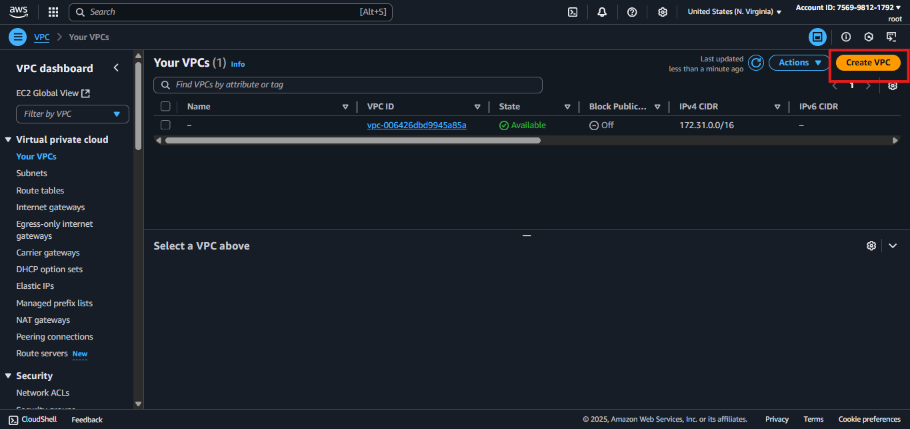

# PROJECT 2

---

# 🩺 Pod 15 DevOps Project Documentation – High Availability Hosting for MediCare

**Team Lead:** Chinazor Nwode

**Assistant Lead:** Ifunanya Benedicta

**Team:** Pod 15 – DevOps Track

**Project Objective:** To build and document a **fault-tolerant AWS VPC infrastructure** for the MediCare healthcare website, with **redundancy across 2 Availability Zones**, **automatic DNS failover via Route 53**, and **web hosting on EC2 instances**.

---

## 🧠 Overview

This project showcases our ability to:

- Design a **2-tier network** using AWS VPC
- Deploy **EC2 instances across two AZs**
- Secure the network with NACLs and security groups
- Deploy a public website with **SSH-based configuration**
- Register a custom domain and configure **DNS failover** using Route 53 health checks

We also documented our progress visually with **screenshots at every stage** to ensure traceability and clarity during review and grading.

---

### **🧩 Architecture Components**

| Component | Description |
| --- | --- |
| **VPC** | `10.0.0.0/16` custom VPC for network isolation |
| **Public Subnet A** | `10.0.1.0/24` in Availability Zone A |
| **Public Subnet B** | `10.0.3.0/24` in Availability Zone B |
| **Private Subnet A** | `10.0.2.0/24` in Availability Zone A |
| **Private Subnet B** | `10.0.4.0/24` in Availability Zone B |
| **Internet Gateway** | Enables public access for web traffic |
| **Route Tables** | Define traffic flow (0.0.0.0/0 routed to IGW) |
| **EC2 Instances (2)** | Amazon Linux-based Nginx web servers in AZ-A and AZ-B |
| **Security Groups** | Restrict and allow traffic based on port and IP rules |
| **NACLs** | Stateless firewalls securing subnet-level traffic flows |
| **Route 53**  | Manages DNS failover between the EC2 instances |

---

## 🔧 Step 1: VPC and Subnet Setup

We built the foundation of our cloud network by setting up a **Virtual Private Cloud (VPC)** and **subnets**. A VPC is like your private office space in the cloud — it gives you full control over networking. Subnets are the rooms in that office, where specific services live.

We designed the network to span across **two Availability Zones (AZ-A and AZ-B)** so that if one zone goes down, the other can keep the service running.

### 1.1 Create a New VPC



We started by creating a custom VPC named `MediCare-VPC`.

- Went to the VPC dashboard in AWS.
- Clicked “Create VPC” and chose VPC only.
- Gave it the CIDR block: `10.0.0.0/16`


- VPC creation form with CIDR block set


- Confirmation screen showing the VPC listed in dashboard


### 1.2 Create Four Subnets (Public and Private in 2 AZs)

We created four subnets to split traffic across two availability zones:


- Public Subnet A → `10.0.1.0/24` in AZ-A


- Private Subnet A → `10.0.2.0/24` in AZ-A


- Public Subnet B → `10.0.3.0/24` in AZ-B


- Private Subnet B → `10.0.4.0/24` in AZ-B


- Subnet creation form showing AZ and CIDR


We confirmed that all subnets were created successfully and attached to the VPC. This was done by reviewing the subnet list filtered by VPC ID.


---

## 🌐  Step 2: Internet Gateway and Routing

To make our public subnets internet-accessible, we configured an **Internet Gateway (IGW)** and updated the **route table**.


### 2.1 Create and Attach Internet Gateway

- Created a new IGW named `Medicare-IGW`


- Attached it to the `MediCare-VPC`


- IGW attached to VPC confirmation


### 2.2 Create Route Table and Add Routes


- Created a custom route table
- Added a route `0.0.0.0/0` pointing to the IGW


- Associated the route table with Public Subnet A and B


- Route table configuration


- Add route screen showing IGW target
- Subnet association page showing Public Subnet A & B linked


---

---

## 🖥️ Step 3: EC2 Instance Deployment

We launched two EC2 instances (Amazon Linux 2) in separate availability zones to host the MediCare website.

### 3.1 Launch EC2 Instances in Both AZs

- Launched Medicare-EC2-A in Public Subnet A (AZ-A)


- Launched Medicare-EC2-B in Public Subnet B (AZ-B)


- Enabled auto-assign public IP for both


### 3.2 Verify EC2 Status and Public IPs

- EC2 instance dashboard showing running state and public IP


### 3.3 Launch EC2-A in Private Subnet A

- Navigate to EC2 → Launch Instance
- AMI: Amazon Linux 2


- Instance type: t2.micro (free tier)
- Network: Select our custom VPC
- Subnet: Choose `Private Subnet A (10.0.2.0/24)`
- Auto-assign public IP: **Disabled**
- Key pair: Select existing `.pem` key


**Security Group Configuration**

- inbound SSH rule for the Elastic IP, which will be attached to our bastion host later
- Inbound MySQL Rule for Database


### 3.4 Launch EC2-B in Private Subnet B

Repeat the same steps for AZ-B:

- Subnet: `Private Subnet B (10.0.4.0/24)`
- Confirm instance is private (no public IP)

📸 **Screenshots to Include:**

- Instance launched in AZ-B private subnet
- Private IP confirmation

---

## 🔐 Step 4: NACL Setup (3+ Screenshots)

### What We Did

We secured our EC2 instances using **shared security groups** and a **common NACL**, applied to both public subnets.

- Network ACL:
    - Allow ports 22 and 80 for inbound and outbound
    
    
    
    
    
    - Associated with both public subnets
    
    
    

---

## 💻 Step 5: SSH Access and Web Server Setup

We installed a web server and deployed the MediCare site on each EC2.

### 5.1 SSH into EC2 Instances

- Used MobaXterm and .pem key to SSH intoMedicare-EC2-A andMedicare-Webserver-B


- MobaXterm SSH session for Medicare-EC2-A


- Terminal connected confirmation

### 5.2 Install Nginx and Git

```bash
sudo yum update -y
sudo yum install nginx git -y
```


### 5.3 Deploy Website

```bash
git clone https://github.com/digitalwitchdemo/mediplus.git
cd mediplus
sudo mv * /usr/share/nginx/html
sudo systemctl restart nginx

```


---

## 🌍 Step 6: Domain Purchase and Route 53 Setup (3+ Screenshots)

### What We Did

We purchased `medicare.pod15.cloud` from GoDaddy and set up **Amazon Route 53** to manage DNS, enabling automatic failover betweenMedicare-EC2-A andMedicare-Webserver-B.


### ✅ Actions Taken:

- Purchased domain
- Created Route 53 Hosted Zone for `medicare.pod15.cloud`
- Added **two A records**:
    - Primary →Medicare-EC2-A public IP
    
    
    
    - Secondary →Medicare-Webserver-B public IP
    
    
    

### 

---

## ❤️ Step 7: Health Check and DNS Failover Testing (3+ Screenshots)

### What We Did

We configured a **Route 53 health check** onMedicare-EC2-A so that if it becomes unhealthy, traffic is automatically routed toMedicare-Webserver-B.

- Created health check onMedicare-EC2-A using port 80 and `/` path


- repeated the same steps and created for `econdary-medicare-server`


- Linked health check to primary A record


### ✅ Actions Taken:

- Shut down Medicare-EC2-A to test failover
- Route 53 failed over to Medicare-Webserver-B
- Restarted Medicare-EC2-A to watch traffic switch back

---

## Step 8: NAT Gateway & Bastion Host Configuration

To allow EC2 instances in **private subnets** to access the internet (for updates, packages, etc.), we configured a **NAT Gateway** in the public subnet. After that, we set up a **Bastion Host** to securely SSH into the private EC2s.

### 8.1 Create Elastic IP for NAT Gateway

- Navigate to **VPC → Elastic IPs → Allocate**


- Allocate a new Elastic IP (EIP) for the NAT Gateway
- Elastic IP allocation confirmation
- EIP listed under the allocated addresses


### 8.2 Create and Attach NAT Gateway

- Go to **VPC → NAT Gateways → Create**
- Select **Public Subnet A (10.0.1.0/24)**
- Use the previously allocated Elastic IP


- NAT Gateway creation screen with correct subnet and EIP
- NAT Gateway status: `Available`


### 8.3 Create Route Tables for Private Subnets

- Navigate to **Route Tables**
- Select the **private route table**
- Add a route:
    - Destination: `0.0.0.0/0`
    - Target: NAT Gateway ID
    
    
    

- Private route table before and after editing
- Route to NAT Gateway confirmed


---

## Step 9: Bastion Host Setup for Secure Private Access

To enable secure SSH access to EC2 instances in the **private subnets**, we configured a **Bastion Host** (also called a jump box) in a public subnet.

This host acts as an intermediary  instead of giving public IPs to private EC2s, we connect to the Bastion and then hop into the private EC2s using internal IP addresses.

### 9.1 Launch Bastion EC2 in Public Subnet

- Go to EC2 → Launch Instance
- Select Amazon Linux 2 (t2.micro for free tier)


- Place in **Public Subnet A**
- Enable **Auto-assign Public IP**
- Attach the same key pair used for your private EC2s


- EC2 launch config (with subnet and public IP enabled)


### 9.2 SSH into Bastion Host

### From a Regular host to Test the security

- We got rejected when we tried to login from a host that was not specified in the security group even with the ssh key


### **From the Specified HOST in the Security Group**

We  use MobaXterm or SSH terminal with my `.pem` key:

```
 sudo ssh -i "bastion.pem" ec2-user@44.215.73.40
```

**Screenshots to Include:**

- MobaXterm or terminal connected to Bastion
- Confirmed SSH session

### 9.3 Allow SSH to Private EC2s from Bastion


Update the **Security Group** of the private EC2s:

- Allow inbound SSH (port 22) **only from the Bastion’s SG** or IP (`44.215.73.40`)
- Private EC2 SG with SSH from Bastion’s SG

### 9.4 SSH Into Private EC2 From Bastion Host


Once inside the Bastion:

```
ssh ec2-user@10.0.2.XX   # Private EC2-A
ssh ec2-user@10.0.4.XX   # Private EC2-B
```

📸 **Screenshots to Include:**

- Terminal inside Bastion connecting to private EC2s
- Success login prompt on private EC2

---

This setup ensures that no private EC2s are directly exposed to the internet, while still maintaining admin access when needed.

## ✅ Final Outcome

| Goal | Status |
| --- | --- |
| Fully functional VPC with 2 AZs | ✅ Completed |
| Redundant web servers in separate AZs | ✅ Completed |
| Secure networking with SGs and NACLs | ✅ Completed |
| Live web server setup on both EC2s | ✅ Completed |
| Domain mapped via Route 53 with failover | ✅ Completed |
| DNS failover tested with shutdown event | ✅ Completed |

---

---

## 🗂️ Submission Checklist

| Item | Status |
| --- | --- |
| `.drawio` VPC diagram | ✅ Included |
| At least 3 screenshots/step | ✅ Captured |
| DNS + Route 53 setup visuals | ✅ Captured |
| PDF/Word doc of this file | ✅ Ready |
| `.pem` key (not uploaded) | ✅ Secured |