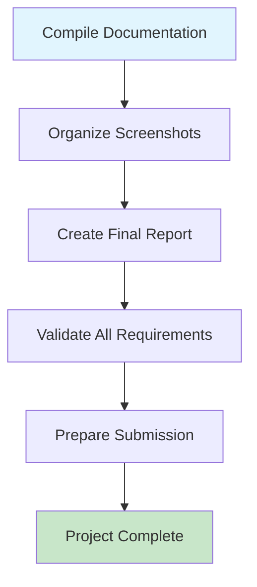

# PROJECT 1

# AWS IAM, Identity Center & Organization Project

## **Team Leader: Chinazor Nwode**

## **Co-Leader:** Ifunanya Benedicta

This document provides a complete overview of our AWS Organization setup project. The objective was to build a secure, multi-account AWS environment with centralized billing, role-based access control, and comprehensive identity management using AWS Identity Center.

- **Project Date:** 11-07-2025
- **Team Members:**  POD 15
- **Cohort:  15**

- **Key Achievements:**
    - 1 Management account + 3 Member accounts (Dev, Staging, Production)
    - AWS Identity Center configured with 5 users in 3 role-based groups
    - 4 permission sets created and assigned across accounts
    - MFA enforced for all users
    - Complete cross-account access validation

### 🏢 Organization Setup

- ✅ 1 Management Account (Root)

- ✅ 3 Member Accounts (Dev, Staging, Production)
- ✅ Centralized billing & governance
- ✅ Account isolation & security

### 👥 Identity Center (SSO)

- ✅ 5 Users in 3 Groups
- ✅ 4 Permission Sets
- ✅ Single Sign-On Portal
- ✅ MFA for all users

### 🔐 Security & Testing

- ✅ Multi-Factor Authentication
- ✅ Least Privilege Access
- ✅ Login Testing & Verification
- ✅ Complete Documentation

---

# TASK 1: Set up AWS Organization

### 

## 1.1 Organization Setup

**Navigate to AWS Organizations:**

- Search for "Organizations" in the services search bar
- Click on "AWS Organizations"

**Create Organization:**

1. Click "Create organization" button
2. Choose "Enable all features" (recommended)
3. Click "Create organization"

**Create Member Accounts:**

**Development Account:**

- Click "Add an AWS account"
- Select "Create an AWS account"
- Account name: “[**Saintic ORG Development](https://us-east-1.console.aws.amazon.com/organizations/v2/home/accounts/808872802004)”**
- Email:  [chinazornwode+SainticOrgDevelopment@gmail.com](mailto:chinazornwode+SainticOrgDevelopment@gmail.com)
- IAM role name: `OrganizationAccountAccessRole`
- Click "Create AWS account"

**Staging Account:**

- Repeat the process with:
- Account name: [**Saintic ORG Staging**](https://us-east-1.console.aws.amazon.com/organizations/v2/home/accounts/304035490366)
- Email: chinazornwode+SainticOrgStaging@gmail.com

**Production Account:**

- Repeat the process with:
- Account name: [**Saintic ORG Production**](https://us-east-1.console.aws.amazon.com/organizations/v2/home/accounts/784691763135)
- Email: [chinazornwode+SainticOrgProduction@gmail.com](mailto:chinazornwode+SainticOrgProduction@gmail.com)

## 1.2 Create Organizational Units (OUs)

**Management OU:**

- On the organization tab,  click on the checkbox before the root
- click on “Action” Dropdown  button
- Then clicked “Create New”

- Click "Create organizational unit"
- Name: `Management OU`

**Development OU:**

- Create OU with name: `Development OU`

**Staging OU:**

- Create OU with name: `Staging OU`

**Production OU:**

- Create OU with name: `Production OU`

### **1.3 Move Accounts to their OUs:**

- Moved each account to its corresponding OU
- Verify organizational structure

In Task 1, the team successfully established a comprehensive AWS Organization structure that serves as the foundation for the entire multi-account environment. 

- Created one management account and three specialized member accounts (Development, Production, and Staging)[[1]](https://www.notion.so/1-Management-Account-Root-2418ee4ba8b881d092e6e217cad77ef1?pvs=21)
- Organized these accounts into logical Organizational Units (OUs) based on function (Management, Development, Production, and Staging)[[2]](https://www.notion.so/created-the-first-which-is-Management-OU-2418ee4ba8b88107b493d1c7e23a6f68?pvs=21)
- Implemented centralized billing and governance mechanisms[[3]](https://www.notion.so/Centralized-billing-governance-2418ee4ba8b88114b27de45001cd2b75?pvs=21)
- Established clear account isolation and security boundaries[[4]](https://www.notion.so/Account-isolation-security-2418ee4ba8b88135a3d2c8495d8be7b5?pvs=21)

This organizational structure provides the architectural foundation for implementing role-based access control, centralized security policies, and effective resource management across all AWS accounts. The hierarchical OU structure also enables more granular policy application and ensures proper separation between development, staging, and production environments.[[5]](https://www.notion.so/2418ee4ba8b881b99339e070bdbba174?pvs=21)

==============================================================

==============================================================

---

# TASK 2: Create Users and Groups in Identity Center

### Overview Flowchart

## 2.1 Enable IAM Identity Center

**Navigate to Identity Center:**

- Search for "IAM Identity Center" in the AWS Console
- Click "Enable IAM Identity Center"

**Choose Region:**

- Select your preferred region for Identity Center
- Click "Enable"

**Identity Center Dashboard:**

- Verified successful enablement
- Accessed the Identity Center dashboard

## 2.2 Create Team Groups

**Admin Team Group:**

- Navigated to "Groups" in Identity Center
- Click "Create group"
- Group name: `Admin-Team`
- Description: `Admin-Team IAM Identity Group`
- Click "Create group"

**Developer Team Group:**

- Created group with name: `Developer-Team`
- Description: `Developer-Team IAM Identity Group`

**DevOps Team Group:**

- Create group with name: `DevOps-Team`
- Description: `DevOPs-Team IAM Identity Group`

### *Screenshot Overview of the Group Created for the IAM Identity Groups*

## 2.3 Create Users and Assign to Groups

**Admin User Creation:**

- Navigate to "Users" in Identity Center
- Click "Add user"
- Username: `Admin-User1`
- Email: `Chinazornwode+admin-user1@gmail.com`
- `First name: `Admin`
- Last name: `User 1`
- Display name: `Admin User 1`

**Assign Admin User to Group:**

- Select "Admin-Team" group
- Click "Add user"
- Choose "Send an email to the user with password setup instructions"

- Reviewed our settings

- Then create

`we’ve created additional user accounts and assigned them to their respective groups for my project, following the same process as before`

**DevOps Users Creation:**

- Create `DevOPs-User1` with email `Chinazornwode+DevOPs-user1@gmail.com`
- Create `DevOPs-User2` with email ``Chinazornwode+DevOPs-user2@gmail.com`
- Assign both to `DevOps-Team` group

**Developer Users Creation:**

- Create `Developer-User1` with email `Chinazornwode+Developer-user1@gmail.com`
- Create `Developer-User2` with email `Chinazornwode+Developer-user2@gmail.com`
- Assign both to `Developer-Team` group

### *Screenshot Overview of the Users Assigned to  Group Created for the IAM Identity Users*

In Task 2, the team successfully implemented AWS IAM Identity Center (formerly SSO) as the central authentication and identity management system.

- Enabled IAM Identity Center in their chosen AWS region
- Created three functional groups (Admin-Team, Developer-Team, DevOps-Team) to reflect organizational roles
- Established five user accounts and assigned them to appropriate groups based on their responsibilities

This identity management foundation enables centralized user administration, simplifies access management across accounts, and establishes the groundwork for implementing the principle of least privilege through role-based access control.

==============================================================

==============================================================

---

# TASK 3: Create Permission Sets

### Overview Flowchart

## 3.1 Navigate to Permission Sets

**Access Permission Sets:**

- In Identity Center, navigate to "Permission sets"
- Click "Create permission set"

## 3.2 Create Admin Permission Set

**Admin-Team Permission Set:**

- Name: `Admin-Team-Permission-Set`
- Description: `Full administrative access for Admin team members`
- Session duration: `8 hours`
- Click "Next"

**Assign Policies:**

- Select "AWS managed policies"
- Search and add: `AdministratorAccess`
- Click "Next" → "Create"

- **`I repeated the same steps to create additional permission sets for the other teams, similar to the screenshot for the Admin-Team-Permission-Set.`**

## 3.3 Create Additional Permission Sets

**PowerUser Permission Set:**

- Name: `Power-User-Permission-Set`
- Description: `Permission set for Power user Team`
- Session duration: `8 hours`
- Add policies: `PowerUserAccess`

**SystemAdmin Permission Set:**

- Name: `Sysadmin-Permission-Set`
- Description: `Permission set for Sysadmin team`
- Session duration: `8 hours`
- Add policies: `SystemAdministrator`

**DataScientist Permission Set:**

- Name: `Datascientist-Permission-Set`
- Description: `Permission set for data scientist team`
- Session duration: `8 hours`
- Add policies: `DataScientist`

### SCREEN SHOT OVERVIEW OF THE PERMISSION SET

In Task 3, the team defined standardized permission sets that establish the access boundaries for different user roles.

- Created four distinct permission sets (Admin-Team-Permission-Set, Power-User-Permission-set, Sysadmin-Permission-Set, and Datascientist-Permission-Set)[[1]](https://www.notion.so/Admin-Team-I-created-a-permission-set-called-Admin-Team-Permission-Set-I-ll-assign-it-later-when-I-2418ee4ba8b881e184ecefc8417e5b8b?pvs=21)
- Configured appropriate session durations (8 hours) to balance security with user convenience[[2]](https://www.notion.so/Insert-my-permission-set-description-and-also-set-the-session-duration-to-8-Hours-2418ee4ba8b88136841be12cde17b83f?pvs=21)
- Established clear permission boundaries aligned with job functions across the organization[[3]](https://www.notion.so/2418ee4ba8b88129a6eefdb7f79af9f5?pvs=21)

These standardized permission sets create reusable access policies that can be consistently applied across accounts, ensuring appropriate access levels while maintaining security and compliance requirements.

==============================================================

==============================================================

---

# TASK 4: Assign Permissions to Groups

### Overview Flowchart

## 4.1 Assigning appropriate permissions to each group using Permission-set policies to enable multi Account Role Switch

**Navigate to AWS Accounts:**

- In Identity Center, go to "AWS accounts"
- Selected my first account in the Development OU [**`Development OU`**](https://us-east-1.console.aws.amazon.com/organizations/v2/home/organizational-units/ou-7dw4-3uk55c9d)
- Click "Assign users or groups"

**Assign Admin-Team to Development Account:**

- Click "Assign users or groups"
- Select "Groups" tab
- Choose "Admin-Team"
- Click "Next"

**Select Permission Set:**

- Choose "Admin-Team-Permission-Set"
- Click "Next"
- Review and click "Submit"

- Then we review our choice and Clicked submit

**Repeat for All Accounts:**

- Assign Admin-Team to Management, Staging, and Production accounts
- Use the same Admin-Team-Permission-Set for all

**Assign DevOps-Team Permissions:**

- For each account, assign DevOps-Team to:
    - `Power-User-Permission-Set`
    - `Sysadmin-Permission-Set`
- Repeat for all four accounts

**Assign Developer-Team Permissions:**

- For each account, assign Developer-Team to:
    - `Datascientist-Permission-Set`
- Repeat for all four accounts

### Screenshot Overview of the Multi Account Permission

- Screen shot of the All team assigned to the development team with appropriate permission set

- Screen Shot of the all teams being assigned to all the accounts in the organization

**Task 4 Achievement:** In Task 4, the team implemented and validated the cross-account access strategy. Assigned team groups to appropriate AWS accounts with their corresponding permission sets, established access pathways across all organizational accounts for each team, tested the entire implementation through user login validation, verified MFA enforcement for enhanced security, and confirmed appropriate access levels and permission set functionality.

=============================================================================================================================

# TASK 5: Multi-Factor Authentication Setup

### Overview Flowchart

## 5.1 Configure MFA Settings

**Navigate to Authentication Settings:**

- In Identity Center, go to "Settings"
- Click "Authentication" tab

**Configure MFA Policy:**

- Under "Multi-factor authentication"

- Select "Users must provide a second factor to sign in"
- Choose "Authenticator apps" and "Security keys"

**Apply Settings:**

- Click "Save changes"
- Verify MFA enforcement is active

## 5.2 Test MFA with All User Types

**Test Admin-User1 MFA:**

- Login with  **Admin-User1**  credentials

- Complete MFA setup process

- Verify successful authentication

- We were logged into the dashboard, and saw the accounts which we were assigned permission to switch role on.

**Task 5 Achievement:** Successfully configured and enforced Multi-Factor Authentication across all user accounts, ensuring enhanced security posture for the organization. All users now require both password and MFA token for authentication, significantly reducing the risk of unauthorized access.

==================================================================================================================================

# TASK 6 : Account Allocation Check

### Overview Flowchart

## 6.1     Check Account Alloocations

- Admin-Team Allocation

- DevOPs-Team Allocation

- Developer-Team Allocation

## 6.2   Check Account Permission Set

- **OVERVIEW OF THE PERMISSION SET**

**Task 6 Achievement:** Successfully checked  and validated the complete user Permission set for all user Teams Group  in their various AWS Account in the organization, confirming that all permissions needed for each of the groups are assigned.

==============================================================================================================================

# TASK 7: User Login Testing and Account Switching

### Overview Flowchart

## 7.1 Complete User Login Testing

**Test Admin-User1 Complete Flow:**

- Navigate to SSO portal
- Enter username and password (first authentication)

- Enter MFA code (second authentication)

- Access dashboard and switch accounts
- So we click on the drop down button  on the “[**Saintic ORG Development](https://756998121792-6a53heoh.us-east-1.console.aws.amazon.com/organizations/v2/home/accounts/808872802004)”**

- So we click the “**Admin-Team-Permission-Set**” button  on the “[**Saintic ORG Development](https://756998121792-6a53heoh.us-east-1.console.aws.amazon.com/organizations/v2/home/accounts/808872802004)”**

- The Link took us to a new page, which means we now logged as admin in the development account

- Lets Verify this

- Checked our Account Policies

- Checked our Account Role

## Question: why is there this permissions in the admin account?

`ANSWER: We made a mistake in permission set earlier by assigning permission that was not meant for the admin which  is unnecessary needed in this context so removed it but was still showing due AWS is kind of keeping the logs or history of whatsoever happed so that when there is an Audit. They can know what happened and when it happend`

## 7.2 Account Switching Documentation

**SSO Portal Interface:**

- Document the single sign-on experience
- Show account switching capabilities
- Demonstrate permission set selection

**Task 7 Achievement:** Successfully tested and validated the complete user experience for all user types, confirming that authentication flows, MFA enforcement, and account switching work seamlessly across the organization.

---

==================================================================================================================================

# TASK 8: Documentation and Final Validation

### Overview Flowchart

## 8.1 Documentation Checklist

### Screenshots Completed:

- [x]  AWS Organizations dashboard with all accounts
- [x]  Organizational Units structure
- [x]  Identity Center users and groups
- [x]  All permission sets created
- [x]  Permission assignments for each account
- [x]  MFA configuration and testing
- [x]  Complete login flows for all user types
- [x]  Account switching demonstrations
- [x]  Cross-account access verification

## 8.2 Final Validation

**Requirements Verification:**
✅ **Organization Setup**: 4 AWS accounts (Management, Dev, Staging, Production)
✅ **User Management**: 5 users distributed across 3 groups
✅ **Permission Management**: 4 permission sets properly configured
✅ **Access Control**: All groups have appropriate permissions across all accounts
✅ **Security**: MFA enabled and working for all users
✅ **Functionality**: Account switching works seamlessly
✅ **Documentation**: Complete screenshot documentation of all processes

---

## 🎓 Lessons Learned

- **Strategic Value of Multi-Account Architecture**: The team discovered that a well-structured multi-account strategy doesn't just improve security, but also creates clearer ownership boundaries and simplifies cost allocation across development, staging, and production environments.
- **Proactive Security Through Identity Federation**: Beyond simply implementing MFA, the team learned that AWS Identity Center creates a centralized authentication point that significantly reduces credential management overhead and security risks compared to managing multiple IAM users across accounts.
- **Permission Templating for Scalability**: The creation of standardized permission sets revealed that defining access patterns once and deploying them consistently across accounts dramatically improves governance and reduces the risk of permission drift over time.
- **Cross-Account Access Workflow Optimization**: The team gained practical experience in balancing security with usability by establishing seamless role-switching capabilities that maintain strict security boundaries while providing a friction-free user experience.
- **Documentation as Risk Mitigation**: The detailed documentation process wasn't just for knowledge transfer - it created an auditable trail that reduces organizational risk by ensuring configurations can be replicated, troubleshot, or validated against compliance requirements.
- **Naming Convention Discipline**: The team discovered that consistent naming conventions across accounts, groups, and permission sets significantly reduced operational complexity and created a more intuitive user experience for both administrators and end users.
- **IAM Trust Relationship Criticality**: The team gained deeper appreciation for how IAM trust relationships form the foundation of cross-account access, and how small misconfiguration details can completely break otherwise well-designed security architectures.

---

---

This project was completed by the dedicated team members who demonstrated exceptional technical skills and collaborative spirit throughout the implementation.

**Thank you for your attention to this comprehensive AWS Organization project.**

> Signed by *SainT*
>